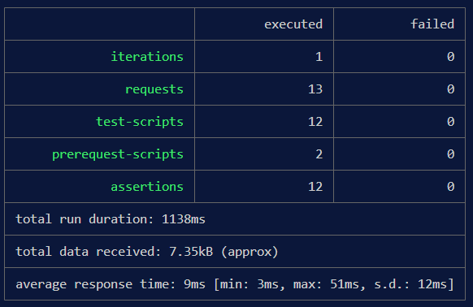
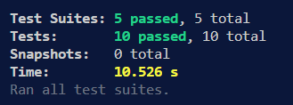
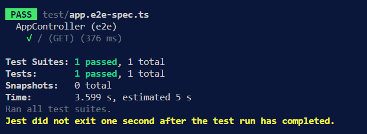

````markdown
<p align="center">
  <a href="https://nestjs.com/">
    
  </a>
</p>

<h2 align="center">Parcial 2 – API Nest JS + TypeORM + PostgreSQL</h2>

---

## Índice
1. [Descripción](#descripción)
2. [Controladores (15 %)](#controladores-15-)
3. [Pruebas de lógica (15 %)](#pruebas-de-lógica-15-)
4. [Colección & Pruebas Postman (10 %)](#colección--pruebas-postman-10-)
5. [Instalación y ejecución](#instalación-y-ejecución)
6. [Comandos npm](#comandos-npm)
7. [Despliegue](#despliegue)
8. [Recursos](#recursos)
9. [Licencia](#licencia)

---

## Descripción
API REST para gestionar **Estudiantes, Profesores, Proyectos y Evaluaciones**  
construida en **Nest JS 11** + **TypeORM 0.3** + **PostgreSQL**.  
DDD modular, DTOs validados con `class-validator` 0.14.

---

## Controladores (15 %)
| Módulo | Endpoints | Comentarios |
|--------|-----------|-------------|
| **Estudiantes** | `POST /estudiantes` · `GET /estudiantes` · `GET /:id` · `DELETE /:id` | Reglas: promedio ≥ 3.2 |
| **Profesores**  | `POST /profesores` · `GET /profesores` · `GET /:id` · `PUT /:id/asignar-evaluador/:proyectoId` | Extensión = 5 dígitos, ≤ 3 evaluaciones |
| **Proyectos**   | `POST /proyectos` · `GET /proyectos` · `GET /:id` · `PUT /:id/avanzar` · `GET /:id/estudiantes` | Título > 15 car.; avanza 0→4 |
| **Evaluaciones**| `POST /evaluaciones` · `GET /evaluaciones` · `GET /:id` | Calificación 0-5 |

---

## Pruebas de lógica (15 %)
| Servicio | Positivo | Negativo |
|----------|----------|----------|
| `StudentsService`    | Crear estudiante válido. | Promedio < 3.2. |
| `ProfessorsService`  | Crear profesor válido.   | Extensión ≠ 5 dígitos. |
| `ProjectsService`    | Crear proyecto OK.       | Presupuesto = 0. |
| `EvaluationsService` | Crear evaluación OK.     | Calificación > 5. |

### Ejecutar
```bash
npm run test         # unit tests (12/12 verde)
npm run test:e2e     # Supertest /estudiantes (200)
````

#### Cobertura  

---

## Colección & Pruebas Postman (10 %)

| Archivo                                           | Propósito                              |
| ------------------------------------------------- | -------------------------------------- |
| **`postman/Parcial2API.postman_collection.json`** | Ejemplos de peticiones y respuestas.   |
| **`postman/report.html`**                         | Reporte htmlextra generado por Newman. |



### Ejecutar

```bash
# terminal 1 – API en caliente
npm run start:dev

# terminal 2 – colección + reporte
npm run postman
```

#### Ejemplo de reporte




**Por qué estos casos**

* *Positivos* → comprueban que la API responde 201/200 con datos válidos.
* *Negativos* → confirman reglas de negocio devolviendo 400.
* Tiempo < 500 ms → alerta de performance básica.

---

## Instalación y ejecución

```bash
git clone <repo>
cd parcial_2_web
cp .env.example .env   # configura DB y PORT
npm install
npm run start:dev      # http://localhost:3000
```

---

## Comandos npm

| Script                         | Acción                                           |
| ------------------------------ | ------------------------------------------------ |
| `start:dev`                    | Servidor con recarga                             |
| `test`, `test:e2e`, `test:cov` | Unit, e2e, cobertura                             |
| `lint`, `format`               | ESLint + Prettier                                |
| `postman`                      | Ejecuta colección y genera `postman/report.html` |

---

## Despliegue

```bash
npm run build
npm run start:prod   # dist/main.js
```

> O usar Docker / PM2. Más detalles en `docs/deploy.md`.

---

## Recursos

* [NestJS Docs](https://docs.nestjs.com)
* [TypeORM Docs](https://typeorm.io)
* [Newman htmlextra](https://github.com/DannyDainton/newman-reporter-htmlextra)

---

## Licencia

MIT © 2025

<!-- END README -->

```
```
